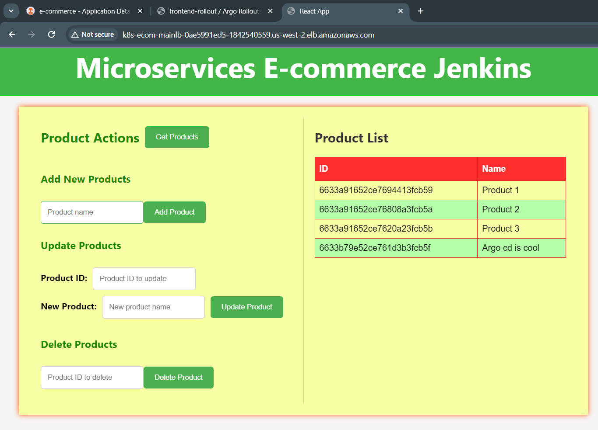
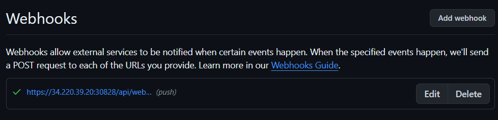
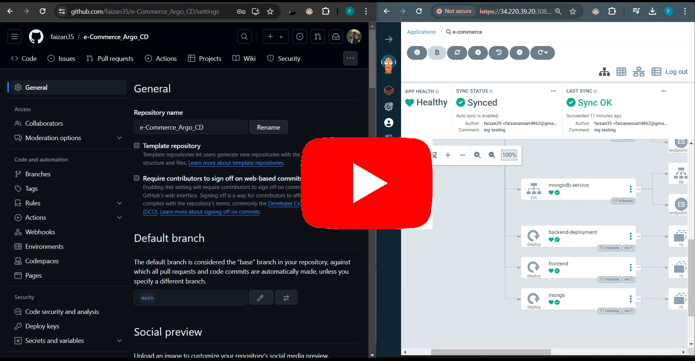
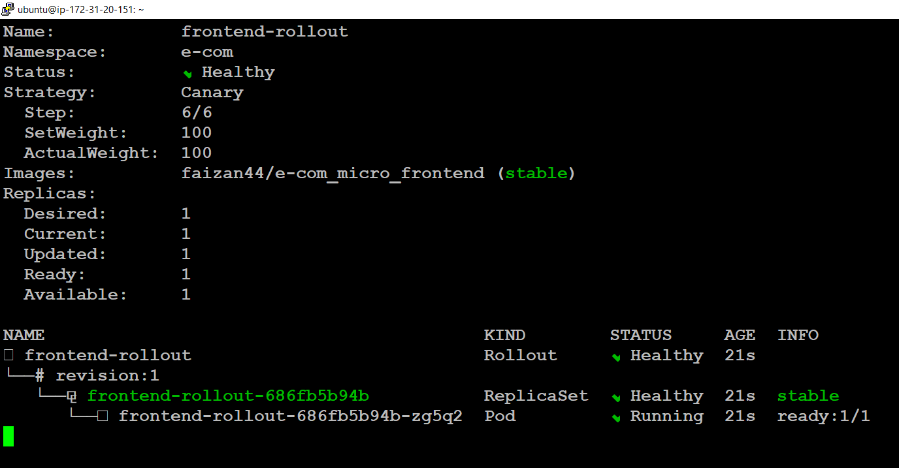
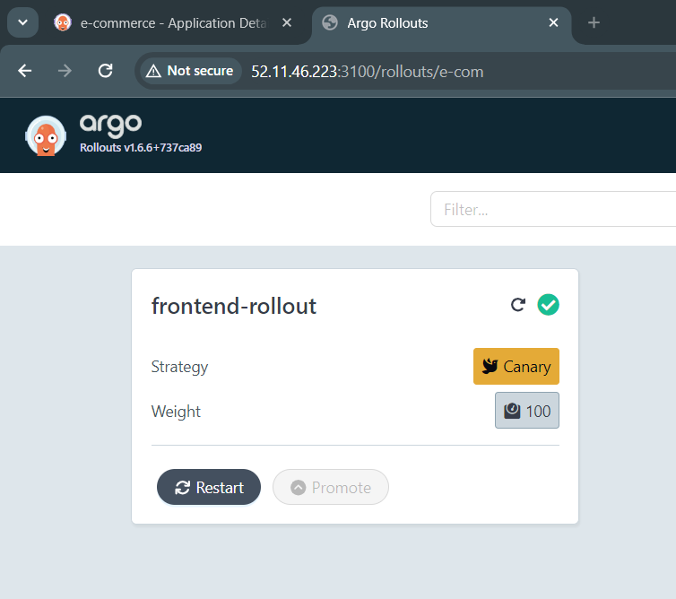
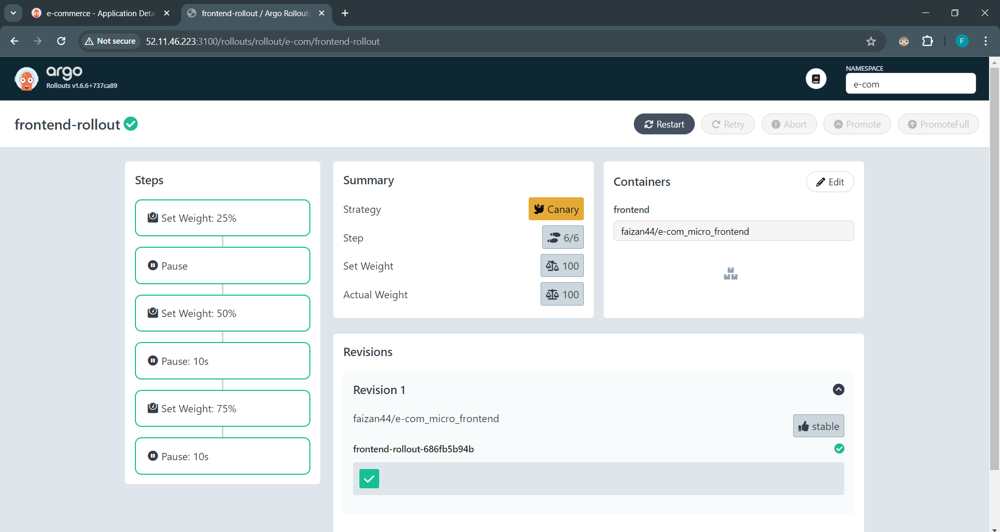
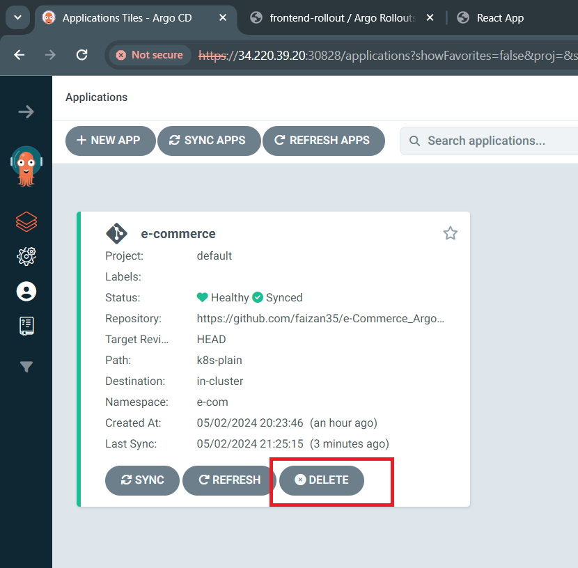
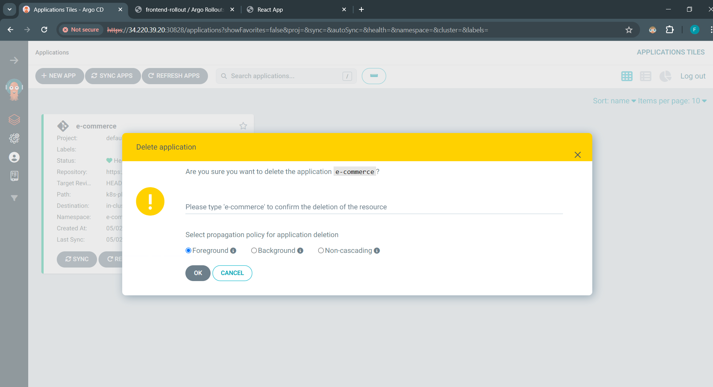
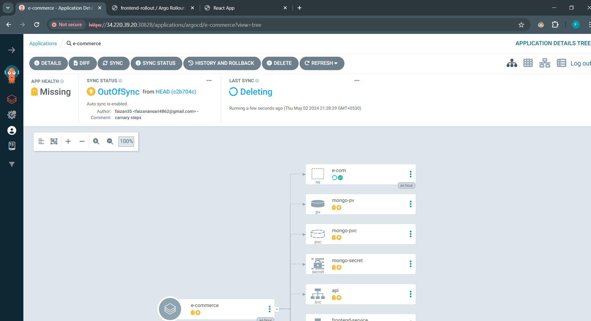

# Microservices E-commerce

Automated GitOps pipeline leveraging Argo CD and Argo Rollouts for seamless continuous deployment and advanced release strategies in Kubernetes.



### Prerequisites

### For EKS

- AWS account

## Task 1: Setup and Configuration

### 1.1. Setting up EKS Cluster

- Follow the detailed guide to setup you EKS cluster. [here](./EKS-Setup/Steps-To-EKS.md)

### 1.2. Install Argo CD on Your Kubernetes Cluster:

- Best practice in production is to deploy Argo in a separate cluster with high availability.
- This ensures Argo remains unaffected by outages in other Kubernetes clusters, maintaining smooth continuous delivery operations.
- But this is a Demo Project anything will work.
- Documentation: [link](https://argo-cd.readthedocs.io/en/stable/getting_started/)

```bash
kubectl create namespace argocd
kubectl apply -n argocd -f https://raw.githubusercontent.com/argoproj/argo-cd/stable/manifests/install.yaml
```

#### 1.2.1 To use the GUI

- Follow the steps form [here](https://github.com/faizan35/Argo_CD_Mastery_Hub/blob/main/Module-02/2.1-Installation-Methods.md).

- **For Minikube only**, port forwarding: `minikube service argocd-server -n argocd`
- **For EKS**:
  - Expose the `NodePort` of `argocd-server` service in your aws security group.
  - to access the dashboard use the ip address of the node-group and port `NordPort`.

### 1.3. Install Argo Rollouts:

```bash
kubectl create namespace argo-rollouts
kubectl apply -n argo-rollouts -f https://github.com/argoproj/argo-rollouts/releases/latest/download/install.yaml
```

#### 1.3.1 To use the GUI

- Follow the steps form [here](https://github.com/faizan35/Argo_CD_Mastery_Hub/blob/main/Module-0x/x.1-Installation-Methods.md).

- **For EKS**:
  - For dashboard you hava to use the IP of the VM in which you are executing the commands.
  - Expose the `3100` Port in your security group, of the VM.
  - open a new terminal and execute this command to see the dashboard: `http://<IP>:3100/rollouts`

## Task 2: Creating the GitOps Pipeline

### 2.1. Dockerize the Application

> We will be creating a CI/CD Jenkins Pipeline, to Build and Upload the image to DockerHub.
> But for now, we will do this step manually.

##### Docker Image in DockerHub Registry

1. **Frontend Image:** `faizan44/e-com_micro_frontend:latest`

2. **Backend Image**: `faizan44/e-com_micro_backend:latest`

### 2.2. Deploy the Application Using Argo CD:

#### 2.2.1. For Minikube Setup only

- access the Frontend.: `minikube service frontend-service -n e-com`

- Port forwardding or tunnelling: `minikube service api -n e-com`

- Paste the `http://<IP>:<PORT>`, in the fronend deployment manifest.

#### 2.2.2. For EKS

##### 2.2.2.1. Paste the copied ingress endpoint to...

- frontend deployment, inside `k8s-plain/plain.yml` value of `REACT_APP_API_URL`.
- rollout manifest here, inside `Argo-Rollout/rollout.yml` value of `REACT_APP_API_URL`.

and commit the changes.

> **Note:** this is done if you dont have a domain.

##### 2.2.2.2. Creating Application with Argo CD

1. After login into the ArgoCD dashboard.

  

1. Click on `+ NEW APP`
2. Click on `EDIT AS YAML`
3. Paste this yaml and click on `SAVE`

   ```yml
   apiVersion: argoproj.io/v1alpha1
   kind: Application
   metadata:
     name: e-commerce
   spec:
     destination:
       name: ""
       namespace: e-com
       server: "https://kubernetes.default.svc"
     source:
       path: k8s-plain
       repoURL: "https://github.com/faizan35/e-Commerce_Argo_CD"
       targetRevision: HEAD
     sources: []
     project: default
     syncPolicy:
       automated:
         prune: false
         selfHeal: false
   ```

4. Click on `CREATE`

- Your Applications should start creating.


#### 2.2.2.3. Argo CD to monitor the Repository

##### a. With Jenkins CI/CD Pipeline

- We will trigger ArgoCD by jenkins POST build pipeline. It will trigger the webhook associated with ArgoCD.

##### b. Without Jenkins

- We will set the webhook but we will manually make commit to the git repo.

##### Setting the Webhook

- **Payload**: `https://34.220.39.20:30828/api/webhook`
- **Payload**: `application/json`

- Click on `Add Webhook`

- 
- 

##### Testing Webhook

- frontend deployment, inside `k8s-plain/plain.yml` make `spec.replicas` count to 3, and commit changes.
- See the below video.

<!-- [](https://youtu.be/P0Xmw7V5a5s) -->

<iframe width="560" height="315" src="https://www.youtube.com/embed/P0Xmw7V5a5s" frameborder="0" allowfullscreen></iframe>

## Task 3: Implementing a Canary Release with Argo Rollouts

### 3.1. Apply Rollout manifest

```bash
kubectl apply -f https://raw.githubusercontent.com/faizan35/e-Commerce_Argo_CD/main/Argo-Rollout/rollout.yml -n e-com
kubectl apply -f https://raw.githubusercontent.com/faizan35/e-Commerce_Argo_CD/main/Argo-Rollout/service.yml -n e-com
```

- To Delete rollout: `kubectl delete rollout frontend-rollout -n e-com`

#### View Rollout in CLI

```bash
kubectl argo rollouts get rollout frontend-rollout -n e-com --watch
```



#### View Rollout in Dashboard




#### Strategy Explanation

```yaml
strategy:
  canary:
    steps:
      - setWeight: 25
      - pause: {}
      - setWeight: 50
      - pause: { duration: 10 }
      - setWeight: 75
      - pause: { duration: 10 }
```

- `canary`: Indicates that the rollout will use a canary deployment strategy.
- `steps`: Specifies a list of steps that define how the canary deployment will proceed.

**The steps are as follows:**

1.  `setWeight: 25`: Initially, 25% of the traffic will be routed to the new version of the application.
2.  `pause: {}`: A pause is introduced after the first step, allowing time for monitoring and evaluation.
3.  `setWeight: 50`: After the pause, the traffic weight is increased to 50%, meaning half of the traffic will now be directed to the new version.
4.  `pause: {duration: 10}`: Another pause follows, this time for a duration of 10 seconds.
5.  `setWeight: 75`: Subsequently, the traffic weight is further increased to 75%, with only 25% of the traffic now being directed to the old version.
6.  `pause: {duration: 10}`: Another pause is introduced, again for a duration of 10 seconds.

## Task 4: Documentation and Cleanup

### Cleanup

#### Delete the application from your cluster

- Click on Delete button, as show in the image.






#### Delete the EKS cluster

```bash
eksctl delete cluster --name e-com-cluster --region us-west-2
```

---

## API Endpoints

- **GET /api/products** Retrieve the list of products.
- **POST /api/products** Add a new product.
- **PUT /api/products/:id** Update an existing product.
- **DELETE /api/products/:id** Delete a product.

## Frontend Usage

- Click the "**Get Products**" button to fetch and display the list of products.
- Add, update, or delete products using the respective sections on the webpage.

## Database

The project uses MongoDB to store product data. Ensure you have MongoDB installed and running locally.

## Technologies Used

- Node.js
- Express.js
- CORS
- MongoDB
- Mongoose
- HTML, CSS, JS

## Contributing

Feel free to contribute to the project by submitting issues or pull requests.

## License

This project is licensed under the MIT License - see the [LICENSE](./LICENSE) file for details.

---
